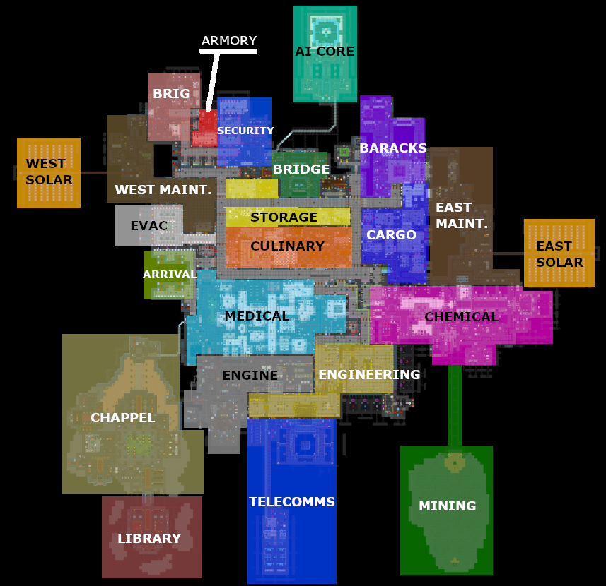

__Map__: Pubby Station (scroll to bottom for map)

__Objective__: Escape on the Emergency Shuttle

__Emergency Shuttle__:
* 35 minutes to arrive
* 5 minutes refuel and leave
* 1 minute to escape and end the round

[__Call the Emergency Shuttle__](https://wiki.ss13.co/Calling_the_Escape_Shuttle):
* Go to the Bridge
* Find the Comm Console 
* Give the commands, in order: commaster, link, call

__Play as Antagonist__:
* Admin > Game Panel > Create Mob > type in the field:
 * royal/queen to play as Xenomorph
 * blob to play as The Blob

Take Control of Mob
* Right Click > Creature > View Variables > Select option > Assume Direct Control

